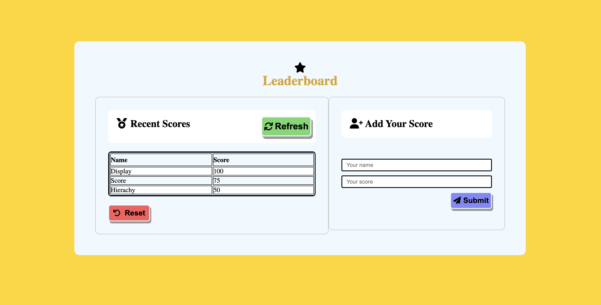

# CHIA'S LEADERBOARD

> A web application people can use to upload their scores, which will be displayed.

## Built With

- Javascript, HTML, CSS
- npm webpack, linters

## Live Demo

Click [this link](https://carlylechia.github.io/Chias-Leaderboard/) to open the application in your browser.

## Getting Started

To get a local copy up and running follow these simple example steps.

### Prerequisites

You will need:

A laptop or tablet, preferably a laptop;
A browser installed like Chrome, Firefox, etc;
A text editor like installed Atom, VS-code, etc;
Terminal or commandline;
Internet connection.

### Setup, Install, and Usage

Proceed to follow these steps:

- Create a folder in the local storage of your computer which will contain the repository;
- open your browser and go to [the project's repository on github](https://github.com/carlylechia/Chias-Leaderboard);
- Click on the `code button` and copy the https link that is provided on the dropdown;
- open terminal or commandline from the folder you created in the first step, and type in the command, "git clone " and then paste the url you copied on the previous step, (https://github.com/carlylechia/Chias-Leaderboard.git).
- finally, you have the repository on your local computer storage. You can now open your text editor and import the repository to start making changes.
- run `npm install` in the project directory to install node_modules and other dependencies.
- also run `npm run start` to start the app
- Now you're good to go.

## Authors

👤 **Chia Carlyle**

- GitHub: [@carlylechia](https://github.com/carlylechia)
- Twitter: [@ChiaCarlyle](https://twitter.com/chiacarlyle)
- LinkedIn: [Chia Carlyle](https://linkedin.com/in/chia-carlyle)

## 🤝 Contributing

Contributions, issues, and feature requests are welcome!

Feel free to check the [issues page](https://github.com/carlylechia/Chias-Leaderboard/issues).

## Show your support

Give a ⭐️ if you like this project!

## Acknowledgments

- Hat tip to the Microverse team for the guidance and reviews.

## 📝 License

This project is [MIT](./MIT.md) licensed.
